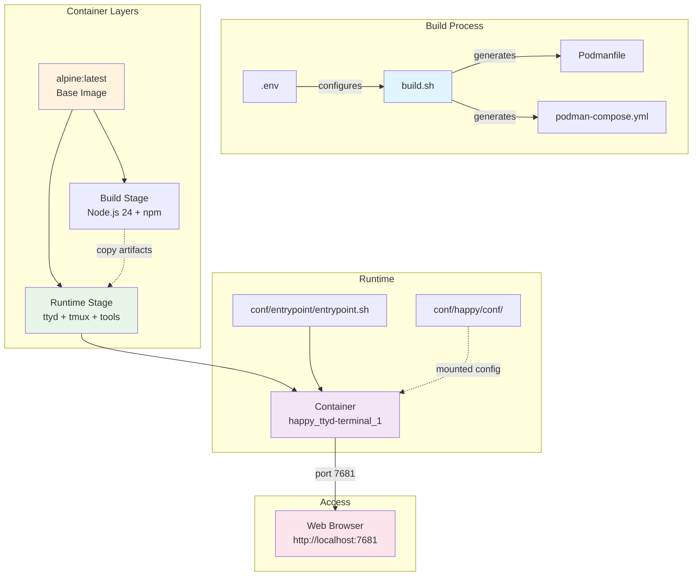

# ttyd Web Terminal Container

A containerized web-based terminal using ttyd on Alpine Linux with Happy Coder integration.

## File Structure

```
.
├── conf/
│   ├── happy/                    # Happy Coder configuration (mounted to /root/.happy)
│   └── entrypoint/
│       └── entrypoint.sh         # Container entrypoint script
├── make-app/                     # Application build components
│   ├── lib/                      # Shared library modules
│   │   ├── common.sh             # Colors, logging, constants
│   │   ├── env-loader.sh         # Environment loading and validation
│   │   └── proxy-handler.sh      # Proxy configuration handling
│   ├── scripts/                  # Executable task scripts
│   │   ├── setup-env.sh          # Interactive .env creation
│   │   ├── generate-podmanfile.sh    # Generate Podmanfile
│   │   ├── generate-compose.sh       # Generate podman-compose.yml
│   │   ├── build-image.sh        # Build container image
│   │   └── registry-push.sh      # Push to GitHub Container Registry
│   └── docs/                     # Documentation
├── .env                          # Environment configuration (gitignored)
├── .env.example                  # Configuration template
├── .gitignore                    # Git ignore rules
├── main.sh                       # Unified project manager (recommended)
├── Makefile                      # Build and deployment automation (alternative)
├── podman-compose.yml            # Container orchestration (generated, gitignored)
└── Podmanfile                    # Container definition (generated, gitignored)
```

## Infrastructure



## Quick Start

### Option 1: Using main.sh (Recommended)

```bash
# Complete setup in one command
./main.sh full-setup

# Or step by step:
./main.sh setup      # Interactive configuration
./main.sh generate   # Generate build files
./main.sh build      # Build container image
./main.sh deploy     # Start services

# Access terminal at http://localhost:7681
```

### Option 2: Using Makefile

```bash
make setup           # Creates .env
make build           # Generates files and builds image
make up              # Start services

# Access terminal at http://localhost:7681
```

## MCP Server Support

The container can optionally include MCP (Model Context Protocol) servers for enhanced functionality.

### Configuration

```bash
# In your .env file

# Enable MCP server installation
INSTALL_MCP_SERVERS=true

# Single repository
MCP_SERVER_REPOS="https://github.com/kwli3229/whatsapp-mcp"

# Multiple repositories (space-separated)
MCP_SERVER_REPOS="https://github.com/kwli3229/whatsapp-mcp https://github.com/user/another-mcp https://github.com/org/third-mcp"

# Base installation path (optional, defaults to /mcp-server)
MCP_SERVER_BASE_PATH=/mcp-server
```

### Directory Structure

After installation, MCP servers will be organized as:

```
/mcp-server/
├── whatsapp-mcp/           # First repository
│   ├── package.json
│   └── ...
├── another-mcp/            # Second repository
│   └── ...
└── third-mcp/              # Third repository
    └── ...
```

### Accessing MCP Servers

```bash
# List all installed MCP servers
ls -la /mcp-server/

# Access specific MCP server
cd /mcp-server/whatsapp-mcp

# Run MCP server (example)
cd /mcp-server/whatsapp-mcp && npm start
```

### Build Process with MCP

When `INSTALL_MCP_SERVERS=true`, the build process includes an additional stage:

1. **BASE**: Alpine Linux with core system packages
2. **BUILD**: Build-time dependencies (Node.js, npm)
3. **MCP**: Clone and prepare MCP servers (NEW)
4. **RUNTIME**: Final runtime environment with MCP servers

## Container Management

### Using main.sh

```bash
./main.sh deploy     # Start services
./main.sh status     # Show project status
./main.sh clean      # Clean up containers and files
./main.sh help       # Show all commands
```

### Using Makefile

```bash
make up              # Start services (alias for compose-up)
make down            # Stop and remove services (alias for compose-down)
make logs            # View container logs
make shell           # Access container shell
```

### Alternative Workflows

```bash
# Direct podman run (simpler deployment)
make deploy                # Deploy without volumes
make deploy-with-volume    # Deploy with workspace volume
make stop                  # Stop container (doesn't remove)
make start                 # Start stopped container

# Compose commands (explicit)
make compose-up            # Start with podman-compose
make compose-down          # Stop with podman-compose
make compose-restart       # Restart services
make compose-logs          # View compose logs

# Maintenance
make clean                 # Remove container + generated files (preserves image)
make clean-all             # Remove container + generated files + image
make prune                 # Remove unused containers and images