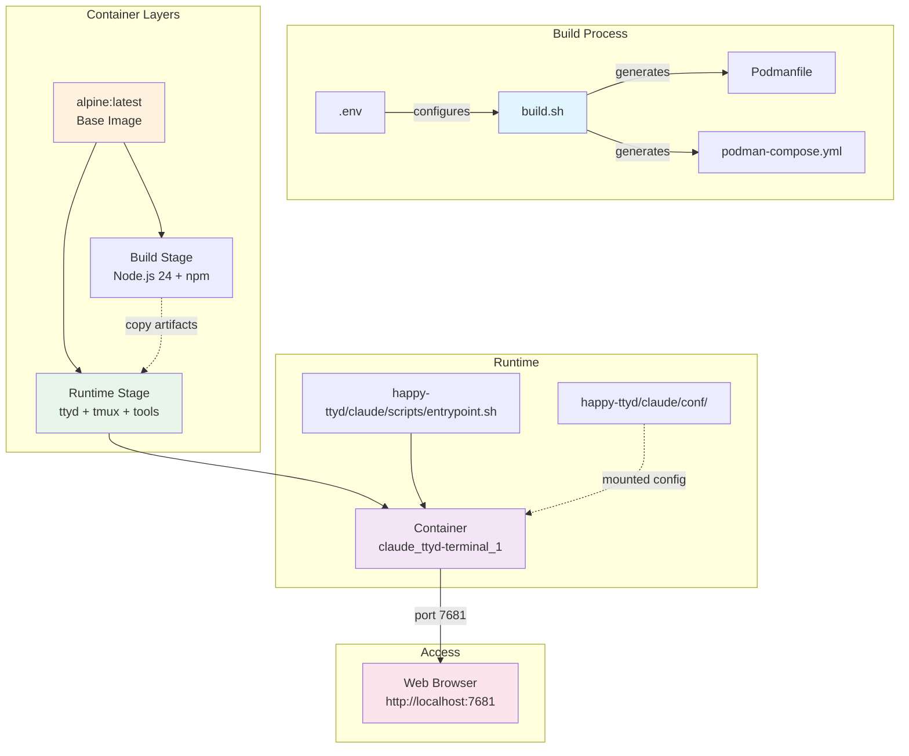

# ttyd Web Terminal Container

A containerized web-based terminal using ttyd on Alpine Linux with Claude Code and Happy Coder integration.

## File Structure

```
.
├── happy-ttyd/
│   └── claude/
│       ├── conf/
│       │   ├── .claude/          # Claude Code configuration and state
│       │   └── .happy/           # Happy Coder configuration and state
│       └── scripts/
│           └── entrypoint.sh     # Container entrypoint script
├── .env                          # Environment configuration (gitignored)
├── .env.example                  # Configuration template
├── .gitignore                    # Git ignore rules
├── build.sh                      # Multi-stage build script with dynamic Podmanfile generation
├── Makefile                      # Build and deployment automation
├── podman-compose.yml            # Container orchestration (generated, gitignored)
└── Podmanfile                    # Container definition (generated, gitignored)
```

## Infrastructure



## Quick Start

```bash
# 1. Setup configuration
cp .env.example .env
# Edit .env with your settings

# 2. Build and deploy
make build
make deploy

# 3. Access terminal
# Open http://localhost:7681 in your browser
```

## Container Management

```bash
# Using podman-compose
make compose-up      # Start services
make compose-down    # Stop services
make compose-logs    # View logs

# Using Makefile
make start           # Start container
make stop            # Stop container
make logs            # View logs
make shell           # Access shell