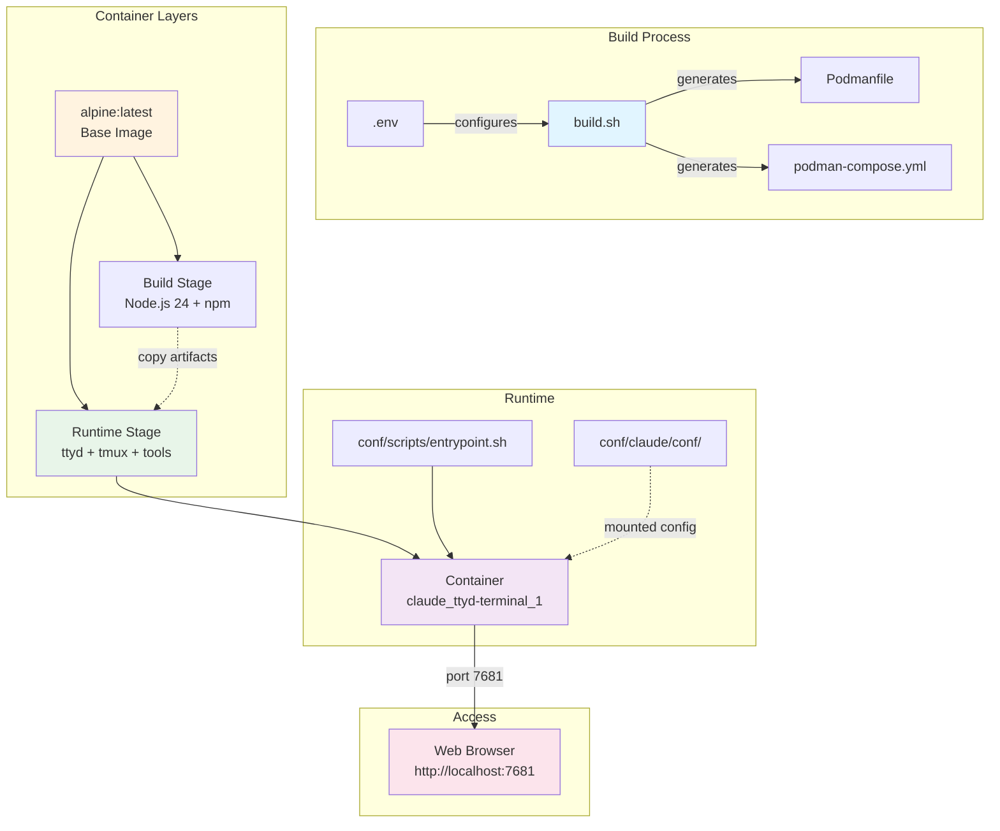

# ttyd Web Terminal Container

A containerized web-based terminal using ttyd on Alpine Linux with Claude Code and Happy Coder integration.

## File Structure

```
.
├── conf/
│   ├── happy/                    # Happy Coder configuration (mounted to /root/.happy)
│   ├── claude/
│   │   └── conf/
│   │       └── .claude/          # Claude Code configuration and state
│   └── scripts/
│       └── entrypoint.sh         # Container entrypoint script
├── .env                          # Environment configuration (gitignored)
├── .env.example                  # Configuration template
├── .gitignore                    # Git ignore rules
├── build.sh                      # Multi-stage build script with dynamic Podmanfile generation
├── Makefile                      # Build and deployment automation
├── podman-compose.yml            # Container orchestration (generated, gitignored)
└── Podmanfile                    # Container definition (generated, gitignored)
```

## Infrastructure



## Quick Start

```bash
# 1. Setup configuration (interactive)
make setup           # Creates .env and opens in vim for editing

# 2. Build container image
make build           # Generates Podmanfile, podman-compose.yml and builds image

# 3. Start services
make up              # Start with podman-compose (recommended)

# 4. Access terminal
# Open http://localhost:7681 in your browser
```

## Container Management

### Recommended Workflow (using podman-compose)

```bash
make up              # Start services (alias for compose-up)
make down            # Stop and remove services (alias for compose-down)
make logs            # View container logs
make shell           # Access container shell
```

### Alternative Workflows

```bash
# Direct podman run (simpler deployment)
make deploy                # Deploy without volumes
make deploy-with-volume    # Deploy with workspace volume
make stop                  # Stop container (doesn't remove)
make start                 # Start stopped container

# Compose commands (explicit)
make compose-up            # Start with podman-compose
make compose-down          # Stop with podman-compose
make compose-restart       # Restart services
make compose-logs          # View compose logs

# Maintenance
make clean                 # Remove container + generated files (preserves image)
make clean-all             # Remove container + generated files + image
make prune                 # Remove unused containers and images