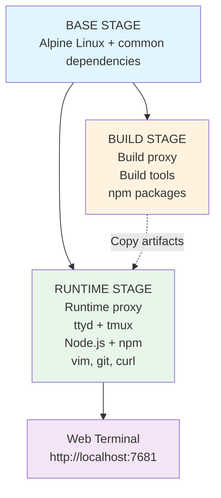

# ttyd Web Terminal Container

A lightweight web-based terminal container using ttyd, built on Alpine Linux with Node.js 24, npm, and vim. Features multi-stage builds with separate proxy configuration for build-time and runtime, persistent sessions via tmux, and Claude Code integration.

## Features

- 🚀 **Multi-stage build** - Optimized image size with separate base, build, and runtime stages
- 🔒 **Dual proxy support** - Independent proxy configuration for build and runtime
- 🛠️ **Developer tools** - Pre-installed with Node.js 24, npm, vim, git, curl, and tmux
- 🌐 **Web-based terminal** - Access your terminal through any web browser
- 💾 **Persistent sessions** - Sessions survive disconnections using tmux
- 🤖 **Claude Code ready** - Pre-configured environment variables for Claude Code integration
- ⚙️ **Easy configuration** - All settings managed via `.env` file

## Architecture



### Persistent Sessions with tmux

The container uses tmux to provide persistent terminal sessions:
- Sessions survive browser disconnections
- Automatic session attachment on reconnect
- Session persists until container stops

## Quick Start

### 1. Setup Configuration

Copy the example configuration file:

```bash
cp .env.example .env
```

Edit `.env` with your settings:

```bash
# Basic configuration
CONTAINER_NAME=ttyd-terminal
TTYD_PORT=7681

# Enable proxies if needed
USE_BUILD_PROXY=false
USE_RUNTIME_PROXY=false
```

### 2. Build the Container

Make the build script executable and run it:

```bash
chmod +x build.sh
./build.sh
```

### 3. Run the Container

After a successful build, the script will display the run command with all configured environment variables. For example:

```bash
podman run -d -p 7681:7681 \
  -e ANTHROPIC_BASE_URL='your-api-url' \
  -e ANTHROPIC_AUTH_TOKEN='your-token' \
  -e ANTHROPIC_MODEL='your-model' \
  -e ANTHROPIC_SMALL_FAST_MODEL='your-model' \
  --name ttyd-terminal ttyd-terminal
```

Or manually with environment variables from `.env`:

```bash
source .env && podman run -d -p ${TTYD_PORT}:7681 \
  -e ANTHROPIC_BASE_URL="${ANTHROPIC_BASE_URL}" \
  -e ANTHROPIC_AUTH_TOKEN="${ANTHROPIC_AUTH_TOKEN}" \
  -e ANTHROPIC_MODEL="${ANTHROPIC_MODEL}" \
  -e ANTHROPIC_SMALL_FAST_MODEL="${ANTHROPIC_SMALL_FAST_MODEL}" \
  --name ${CONTAINER_NAME} ${CONTAINER_NAME}
```

### 4. Access the Terminal

Open your browser and navigate to:

```
http://localhost:7681
```

## Configuration Reference

### Base Configuration

| Variable | Description | Default |
|----------|-------------|---------|
| `CONTAINER_NAME` | Name of the container image | `ttyd-terminal` |
| `TTYD_PORT` | Port to expose ttyd on | `7681` |
| `TTYD_USER` | User for ttyd session | `root` |

### Build-Time Configuration

Used during container image creation:

| Variable | Description | Example |
|----------|-------------|---------|
| `USE_BUILD_PROXY` | Enable proxy during build | `true` or `false` |
| `BUILD_HTTP_PROXY` | HTTP proxy for build | `http://proxy.example.com:8080` |
| `BUILD_HTTPS_PROXY` | HTTPS proxy for build | `http://proxy.example.com:8080` |
| `BUILD_NO_PROXY` | Bypass proxy for these hosts | `localhost,127.0.0.1` |
| `NODE_VERSION` | Node.js version | `24` |

### Runtime Configuration

Used when container is running:

| Variable | Description | Example |
|----------|-------------|---------|
| `USE_RUNTIME_PROXY` | Enable proxy at runtime | `true` or `false` |
| `RUNTIME_HTTP_PROXY` | HTTP proxy for runtime | `http://proxy.example.com:8080` |
| `RUNTIME_HTTPS_PROXY` | HTTPS proxy for runtime | `http://proxy.example.com:8080` |
| `RUNTIME_NO_PROXY` | Bypass proxy for these hosts | `localhost,127.0.0.1` |

### Claude Code Configuration

Used for Claude Code integration:

| Variable | Description | Example |
|----------|-------------|---------|
| `ANTHROPIC_BASE_URL` | Anthropic API endpoint | `https://api.anthropic.com/v1` |
| `ANTHROPIC_AUTH_TOKEN` | API authentication token | `your-api-token` |
| `ANTHROPIC_MODEL` | Model to use | `claude-3-sonnet-20240229` |
| `ANTHROPIC_SMALL_FAST_MODEL` | Small/fast model | `claude-3-haiku-20240307` |

## Proxy Configuration

### Build-Time Proxy

Enable when you need proxy access during image building (e.g., to download packages):

```bash
USE_BUILD_PROXY=true
BUILD_HTTP_PROXY=http://your-proxy:8080
BUILD_HTTPS_PROXY=http://your-proxy:8080
BUILD_NO_PROXY=localhost,127.0.0.1
```

### Runtime Proxy

Enable when the running container needs proxy access (e.g., for npm installs or git operations):

```bash
USE_RUNTIME_PROXY=true
RUNTIME_HTTP_PROXY=http://your-proxy:8080
RUNTIME_HTTPS_PROXY=http://your-proxy:8080
RUNTIME_NO_PROXY=localhost,127.0.0.1
```

## Usage Examples

### Basic Usage

```bash
# Build the image
./build.sh

# Run the container
podman run -d -p 7681:7681 --name ttyd-terminal ttyd-terminal

# Access at http://localhost:7681
```

### With Volume Mount

Mount a local directory for persistent workspace:

```bash
podman run -d -p 7681:7681 \
  -v $(pwd)/workspace:/workspace \
  --name ttyd-terminal \
  ttyd-terminal
```

### Custom Port

```bash
# Edit .env
TTYD_PORT=8080

# Rebuild
./build.sh

# Run with custom port
podman run -d -p 8080:7681 --name ttyd-terminal ttyd-terminal
```

### Interactive Mode

Run in foreground for testing:

```bash
podman run --rm -it -p 7681:7681 ttyd-terminal
```

## Container Management

### Stop the Container

```bash
podman stop ttyd-terminal
```

### Start the Container

```bash
podman start ttyd-terminal
```

### Remove the Container

```bash
podman rm -f ttyd-terminal
```

### View Logs

```bash
podman logs ttyd-terminal
```

### Access Container Shell

```bash
podman exec -it ttyd-terminal bash
```

## Installed Tools

The runtime image includes:

- **ttyd** - Web-based terminal
- **tmux** - Terminal multiplexer for persistent sessions
- **Node.js 24** - JavaScript runtime
- **npm** - Package manager
- **vim** - Text editor
- **bash** - Shell
- **git** - Version control
- **curl** - HTTP client
- **jq** - JSON processor
- **tree** - Directory tree viewer
- **htop** - Process viewer

## Troubleshooting

### Build Fails with Network Error

If building behind a proxy, ensure build-time proxy is configured:

```bash
USE_BUILD_PROXY=true
BUILD_HTTP_PROXY=http://your-proxy:8080
```

### npm Commands Fail in Running Container

If npm needs proxy access at runtime:

```bash
USE_RUNTIME_PROXY=true
RUNTIME_HTTP_PROXY=http://your-proxy:8080
```

### Port Already in Use

Change the port in `.env`:

```bash
TTYD_PORT=8080
```

Or use a different host port:

```bash
podman run -d -p 8080:7681 --name ttyd-terminal ttyd-terminal
```

### Rebuilding After Changes

Remove old image and rebuild:

```bash
podman rmi ttyd-terminal
./build.sh
```

## Persistent Sessions

The container uses tmux to provide persistent terminal sessions:

### How It Works

1. **First Connection**: When you access http://localhost:7681, ttyd automatically creates or attaches to a tmux session named "main"
2. **Disconnect**: Close your browser or lose connection - your session continues running
3. **Reconnect**: Open the terminal again - you'll resume exactly where you left off
4. **Session Lifetime**: Sessions persist until the container is stopped or restarted

### Benefits

- Running processes continue even when disconnected
- Command history preserved across sessions
- Multiple concurrent connections attach to the same session
- No lost work from accidental browser closures

### tmux Basics

While in the terminal, you can use tmux commands:

```bash
# Create a new window
Ctrl-b c

# Switch between windows
Ctrl-b n  # next window
Ctrl-b p  # previous window

# Split panes
Ctrl-b %  # vertical split
Ctrl-b "  # horizontal split

# Detach from session (session continues running)
Ctrl-b d
```

## Project Structure

```
.
├── .env                    # Your configuration (create from .env.example)
├── .env.example           # Example configuration template
├── build.sh               # Multi-stage build script with dynamic Podmanfile generation
├── Podmanfile             # Generated during build (gitignored)
├── README.md              # This file
└── scripts/
    ├── entrypoint.sh      # Container entrypoint script (configures tmux)
    └── claude-models.sh   # Claude models helper script
```

## Advanced Configuration

### Adding Custom APK Packages

Use the `EXTRA_APK_PACKAGES` variable in `.env`:

```bash
EXTRA_APK_PACKAGES="python3 py3-pip wget"
```

Or edit the Podmanfile template in `build.sh`:

```dockerfile
RUN apk add --no-cache \
    ttyd \
    nodejs \
    npm \
    vim \
    your-package-here \
    && rm -rf /var/cache/apk/*
```

### Adding Custom NPM Packages

Use the `EXTRA_NPM_PACKAGES` variable in `.env`:

```bash
EXTRA_NPM_PACKAGES="typescript nodemon pm2"
```

### Custom ttyd Options

Modify `scripts/entrypoint.sh` to add ttyd options:

```bash
# Add authentication
exec ttyd -W -t fontSize=16 -p 7681 -c user:password bash -c "tmux new-session -A -s main"

# Or change tmux session name
exec ttyd -W -t fontSize=16 -p 7681 bash -c "tmux new-session -A -s mysession"
```

### Claude Code Integration

To use Claude Code with this container:

1. Configure the environment variables in `.env`:
```bash
ANTHROPIC_BASE_URL=https://api.anthropic.com/v1
ANTHROPIC_AUTH_TOKEN=your-api-token
ANTHROPIC_MODEL=claude-3-sonnet-20240229
ANTHROPIC_SMALL_FAST_MODEL=claude-3-haiku-20240307
```

2. Rebuild and run with the variables:
```bash
./build.sh
```

3. The environment variables will be available in the container for Claude Code to use

## Security Considerations

1. **Authentication**: Consider adding ttyd authentication for production use
2. **Port Binding**: Bind to localhost only: `-p 127.0.0.1:7681:7681`
3. **API Credentials**: Never commit `.env` file with API tokens or proxy credentials
4. **Network Isolation**: Use Podman networks for container isolation
5. **Environment Variables**: Keep sensitive tokens in `.env` file (gitignored by default)

## License

This project is provided as-is for educational and development purposes.

## Contributing

Feel free to submit issues and enhancement requests!