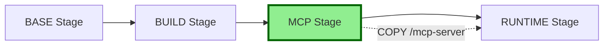

# MCP Server Installation - Implementation Plan

## Overview
Add MCP (Model Context Protocol) server installation capability to the happy-ttyd container build process. This will enable the container to include MCP servers for enhanced functionality.

## Requirements
- Clone `https://github.com/kwli3229/whatsapp-mcp` into `/mcp-server` directory
- Make installation optional via `.env` configuration
- Repository is ready to use after cloning (no build steps required)
- Maintain existing multi-stage build architecture

## Architecture Design

### Current Build Stages
1. **BASE**: Alpine Linux with core system packages
2. **BUILD**: Build-time dependencies (Node.js, npm)
3. **RUNTIME**: Final runtime environment

### New Build Stages (After Implementation)
1. **BASE**: Alpine Linux with core system packages
2. **BUILD**: Build-time dependencies (Node.js, npm)
3. **MCP** (NEW): MCP server installation stage
4. **RUNTIME**: Final runtime environment with MCP server

### Stage Flow Diagram



## Implementation Details

### 1. Configuration Changes

#### File: `.env.example`
Add new section after line 23:

```bash
# ===== MCP SERVER CONFIGURATION =====
# Enable MCP server installation in container
INSTALL_MCP_SERVERS=false

# MCP Server repositories (space-separated list)
# Each repo will be cloned into /mcp-server/<repo-name>
# Format: "https://github.com/user/repo1 https://github.com/user/repo2"
MCP_SERVER_REPOS="https://github.com/kwli3229/whatsapp-mcp"

# Base path for MCP servers (all repos cloned here)
MCP_SERVER_BASE_PATH=/mcp-server
```

**Default Values:**
- `INSTALL_MCP_SERVERS`: `false` (opt-in feature)
- `MCP_SERVER_REPOS`: Space-separated list of repository URLs
- `MCP_SERVER_BASE_PATH`: Base installation path (default: `/mcp-server`)

**Directory Structure:**
```
/mcp-server/
├── whatsapp-mcp/      (from first repo)
├── another-mcp/       (from second repo)
└── ...
```

**Examples:**

Single repository:
```bash
MCP_SERVER_REPOS="https://github.com/kwli3229/whatsapp-mcp"
```

Multiple repositories:
```bash
MCP_SERVER_REPOS="https://github.com/kwli3229/whatsapp-mcp https://github.com/user/another-mcp https://github.com/org/third-mcp"
```

### 2. Generator Script Changes

#### File: `make-app/scripts/generate-podmanfile.sh`

##### A. Add New Function (after `generate_build_stage()`)

```bash
# Generate the MCP server installation stage
generate_mcp_stage() {
    cat >> "$PODMANFILE" << 'EOF'
# =====================================
# STAGE 3: MCP SERVER
# =====================================
FROM base AS mcp
EOF

    # Add proxy configuration if enabled
    if [ "$USE_BUILD_PROXY" = "true" ]; then
        cat >> "$PODMANFILE" << 'EOF'

# Build-time proxy configuration for git clone
ARG BUILD_HTTP_PROXY=${BUILD_HTTP_PROXY}
ARG BUILD_HTTPS_PROXY=${BUILD_HTTPS_PROXY}
ARG BUILD_NO_PROXY=${BUILD_NO_PROXY}

ENV HTTP_PROXY=${BUILD_HTTP_PROXY}
ENV HTTPS_PROXY=${BUILD_HTTPS_PROXY}
ENV NO_PROXY=${BUILD_NO_PROXY}

# Configure git proxy
RUN if [ -n "$HTTP_PROXY" ]; then \
        git config --global http.proxy "$HTTP_PROXY" && \
        git config --global https.proxy "$HTTPS_PROXY"; \
    fi
EOF
    fi

    # Add git installation
    cat >> "$PODMANFILE" << 'EOF'

# Install git if not already present
RUN apk add --no-cache git \
    && rm -rf /var/cache/apk/*

EOF

    # Create base directory
    cat >> "$PODMANFILE" << EOF

# Create MCP server base directory
RUN mkdir -p ${MCP_SERVER_BASE_PATH}

EOF

    # Clone each repository in the list
    # Parse the space-separated list of repositories
    IFS=' ' read -ra REPOS <<< "$MCP_SERVER_REPOS"
    
    for repo in "${REPOS[@]}"; do
        # Extract repository name from URL (last part after /)
        local repo_name=$(basename "$repo" .git)
        
        cat >> "$PODMANFILE" << EOF
# Clone MCP server: ${repo_name}
RUN git clone ${repo} ${MCP_SERVER_BASE_PATH}/${repo_name}

EOF
    done
}
```

**Key Features:**
- Parses space-separated list of repository URLs
- Extracts repository name from each URL
- Clones each repository into its own subdirectory under `MCP_SERVER_BASE_PATH`
- Maintains individual repo names for easy identification

##### B. Modify `generate_runtime_stage()` Function

Update the RUNTIME stage to include conditional MCP server copy:

**Location**: After line 118 (after `FROM base AS runtime`)

Add this section before the locale settings:

```bash
# Copy MCP servers if installed
if [ "$INSTALL_MCP_SERVERS" = "true" ]; then
    cat >> "$PODMANFILE" << EOF

# Copy all MCP servers from mcp stage
COPY --from=mcp ${MCP_SERVER_BASE_PATH} ${MCP_SERVER_BASE_PATH}
EOF
fi
```

**Note:** This copies the entire `/mcp-server` directory with all cloned repositories in one operation.

##### C. Update `generate_podmanfile()` Function

Modify the stage generation logic (around line 208):

```bash
generate_podmanfile() {
    log_info "Generating Podmanfile..."
    
    # Remove existing Podmanfile if present
    if [ -f "$PODMANFILE" ]; then
        rm -f "$PODMANFILE"
    fi
    
    # Generate each stage
    generate_base_stage
    generate_build_stage
    
    # Generate MCP stage if enabled
    if [ "$INSTALL_MCP_SERVERS" = "true" ]; then
        generate_mcp_stage
    fi
    
    generate_runtime_stage
    
    log_success "Podmanfile generated successfully at $PODMANFILE"
}
```

**Note:** Variable name changed from `INSTALL_MCP_SERVER` to `INSTALL_MCP_SERVERS` for clarity.

##### D. Update `show_summary()` Function

Add MCP server information display (after line 248):

```bash
if [ "$INSTALL_MCP_SERVERS" = "true" ]; then
    echo -e "  ${BLUE}MCP Servers:${NC} Enabled"
    echo "    Base Path: ${MCP_SERVER_BASE_PATH}"
    
    # Parse and display each repository
    IFS=' ' read -ra REPOS <<< "$MCP_SERVER_REPOS"
    echo "    Repositories (${#REPOS[@]}):"
    for repo in "${REPOS[@]}"; do
        local repo_name=$(basename "$repo" .git)
        echo "      - ${repo_name}: ${repo}"
    done
    echo ""
fi
```

**Enhanced Display:**
- Shows total count of repositories
- Lists each repository with its extracted name
- Displays base installation path

### 3. Environment Validation

#### File: `make-app/lib/env-loader.sh`

Add validation for MCP server variables (if this file handles validation):

```bash
# Validate MCP server configuration if enabled
if [ "$INSTALL_MCP_SERVERS" = "true" ]; then
    if [ -z "$MCP_SERVER_REPOS" ]; then
        log_error "MCP_SERVER_REPOS must be set when INSTALL_MCP_SERVERS is true"
        exit 1
    fi
    if [ -z "$MCP_SERVER_BASE_PATH" ]; then
        log_error "MCP_SERVER_BASE_PATH must be set when INSTALL_MCP_SERVERS is true"
        exit 1
    fi
    
    # Validate that repositories list is not empty and contains valid URLs
    IFS=' ' read -ra REPOS <<< "$MCP_SERVER_REPOS"
    if [ ${#REPOS[@]} -eq 0 ]; then
        log_error "MCP_SERVER_REPOS cannot be empty when INSTALL_MCP_SERVERS is true"
        exit 1
    fi
    
    # Basic URL validation for each repository
    for repo in "${REPOS[@]}"; do
        if [[ ! "$repo" =~ ^https?:// ]]; then
            log_error "Invalid repository URL: $repo (must start with http:// or https://)"
            exit 1
        fi
    done
fi
```

**Enhanced Validation:**
- Checks that repository list is not empty
- Validates each URL starts with http:// or https://
- Provides clear error messages for each validation failure

### 4. Documentation Updates

#### File: `README.md`

Add section about MCP server support:

```markdown
### MCP Server Support

The container can optionally include MCP (Model Context Protocol) servers for enhanced functionality.

**Configuration:**

```bash
# In your .env file

# Enable MCP server installation
INSTALL_MCP_SERVERS=true

# Single repository
MCP_SERVER_REPOS="https://github.com/kwli3229/whatsapp-mcp"

# Multiple repositories (space-separated)
MCP_SERVER_REPOS="https://github.com/kwli3229/whatsapp-mcp https://github.com/user/another-mcp https://github.com/org/third-mcp"

# Base installation path (optional, defaults to /mcp-server)
MCP_SERVER_BASE_PATH=/mcp-server
```

**Directory Structure:**

After installation, MCP servers will be organized as:

```
/mcp-server/
├── whatsapp-mcp/           # First repository
│   ├── package.json
│   └── ...
├── another-mcp/            # Second repository
│   └── ...
└── third-mcp/              # Third repository
    └── ...
```

**Accessing MCP Servers:**

```bash
# List all installed MCP servers
ls -la /mcp-server/

# Access specific MCP server
cd /mcp-server/whatsapp-mcp

# Run MCP server (example)
cd /mcp-server/whatsapp-mcp && npm start
```
```

## Testing Plan

### 1. Test with MCP Servers Disabled (Default)
```bash
# Should generate Podmanfile without MCP stage
./main.sh setup
# Set INSTALL_MCP_SERVERS=false in .env
./main.sh generate
# Verify Podmanfile has only 3 stages (BASE, BUILD, RUNTIME)
./main.sh build
./main.sh deploy
```

### 2. Test with Single MCP Server
```bash
# Should generate Podmanfile with MCP stage (single repo)
./main.sh setup
# Set in .env:
#   INSTALL_MCP_SERVERS=true
#   MCP_SERVER_REPOS="https://github.com/kwli3229/whatsapp-mcp"
./main.sh generate
# Verify Podmanfile has 4 stages and single git clone command
./main.sh build
./main.sh deploy
# Verify /mcp-server/whatsapp-mcp exists in running container
podman exec happy-ttyd ls -la /mcp-server/
podman exec happy-ttyd ls -la /mcp-server/whatsapp-mcp/
```

### 3. Test with Multiple MCP Servers
```bash
# Should generate Podmanfile with MCP stage (multiple repos)
./main.sh setup
# Set in .env:
#   INSTALL_MCP_SERVERS=true
#   MCP_SERVER_REPOS="https://github.com/kwli3229/whatsapp-mcp https://github.com/user/repo2"
./main.sh generate
# Verify Podmanfile has 4 stages and multiple git clone commands
./main.sh build
./main.sh deploy
# Verify all MCP servers exist in running container
podman exec happy-ttyd ls -la /mcp-server/
podman exec happy-ttyd ls -la /mcp-server/whatsapp-mcp/
podman exec happy-ttyd ls -la /mcp-server/repo2/
```

### 4. Test with Proxy Configuration
```bash
# Test with both build proxy and MCP servers enabled
# Set USE_BUILD_PROXY=true and INSTALL_MCP_SERVERS=true
./main.sh generate
./main.sh build
# Verify git uses proxy during all clones
```

### 5. Test Error Handling
```bash
# Test with empty repository list
# Set INSTALL_MCP_SERVERS=true and MCP_SERVER_REPOS=""
./main.sh generate
# Should show validation error

# Test with invalid URL
# Set MCP_SERVER_REPOS="not-a-valid-url"
./main.sh generate
# Should show validation error for invalid URL format
```

## File Changes Summary

| File | Change Type | Description |
|------|-------------|-------------|
| `.env.example` | Add | MCP servers configuration with multi-repo support |
| `make-app/scripts/generate-podmanfile.sh` | Modify | Add MCP stage generation with loop for multiple repos |
| `make-app/lib/env-loader.sh` | Modify | Add MCP configuration validation with URL checks |
| `README.md` | Add | MCP servers documentation with multi-repo examples |
| `docs/mcp-server-implementation-plan.md` | Create | This implementation plan |

## Risk Mitigation

### Potential Issues & Solutions

1. **Git clone fails for any repository**
   - Solution: Ensure git is installed in MCP stage
   - Solution: Handle proxy configuration for git
   - Solution: Add error handling in clone loop

2. **Repository URL becomes invalid**
   - Solution: Make repository URLs configurable via `.env`
   - Solution: Add validation for URL format (http/https check)
   - Solution: Fail fast with clear error messages

3. **Stage ordering issues**
   - Solution: Carefully maintain stage order in generator script
   - Solution: Test both enabled and disabled scenarios
   - Solution: Test with single and multiple repos

4. **Disk space concerns with multiple repos**
   - Solution: Clean up git cache after each clone if needed
   - Solution: Document approximate size impact per repo
   - Solution: Consider shallow clones for large repos (--depth 1)

5. **Repository name conflicts**
   - Solution: Use basename extraction for directory names
   - Solution: Document naming convention
   - Solution: Consider adding custom naming in future

6. **Parsing issues with repository list**
   - Solution: Use IFS=' ' for space-separated parsing
   - Solution: Trim whitespace from URLs
   - Solution: Validate non-empty list

## Next Steps for Implementation

1. ✅ Update `.env.example` with MCP configuration
2. ✅ Create `generate_mcp_stage()` function
3. ✅ Modify `generate_runtime_stage()` to copy MCP files
4. ✅ Update `generate_podmanfile()` main logic
5. ✅ Update `show_summary()` function
6. ✅ Add environment validation (if needed)
7. ✅ Test generation with feature disabled
8. ✅ Test generation with feature enabled
9. ✅ Test complete build and deploy cycle
10. ✅ Update README.md documentation

## Success Criteria

- [ ] Podmanfile generates correctly with `INSTALL_MCP_SERVERS=false` (default)
- [ ] Podmanfile includes MCP stage with `INSTALL_MCP_SERVERS=true`
- [ ] Container builds successfully with single MCP server
- [ ] Container builds successfully with multiple MCP servers
- [ ] `/mcp-server` directory exists with correct subdirectories for each repo
- [ ] Each cloned repository is complete and accessible
- [ ] Proxy configuration works correctly with all git clones
- [ ] URL validation catches invalid repository URLs
- [ ] Empty repository list is properly rejected
- [ ] Summary displays all repositories with correct counts
- [ ] Documentation includes multi-repo examples
- [ ] No breaking changes to existing functionality

## Approval Required

This plan is ready for review. Once approved, switch to Code mode to implement the changes.